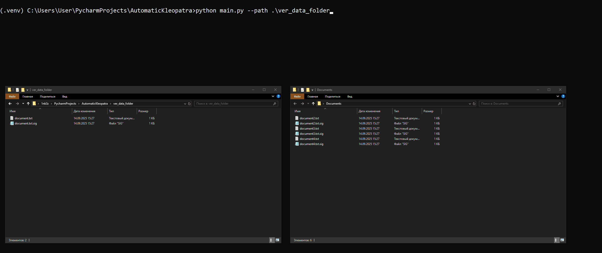
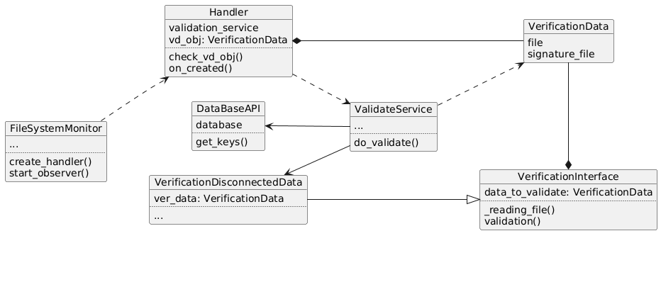

# 🔐✍️ Auto-Kleopatra

## ENG
This utility simplifies the process of checking incoming documents for the correctness of their electronic signature. It scans your selected directory for new files, if this event occurs --> files are checked.

## RU
Данная утилита упрощает процесс проверки поступающих документов на корректность их электронной подписи. Она просматривает выбранную вами директорию на наличие новых файлов, если данное событие происходит --> файлы проверяются.

### Usage
python main.py --path <path to the monitored folder\>

## Example

## UML code diagram

